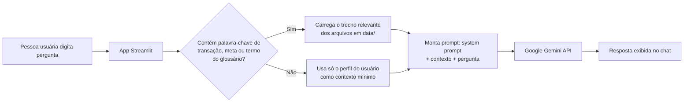

# 📄 Documentação do Agente

## Caso de uso

**Problema:** boa parte das pessoas não tem dificuldade em *ganhar* dinheiro, tem dificuldade em *entender* pra onde o dinheiro está indo — e a educação financeira formal raramente chega até elas em linguagem acessível.

**Solução:** o Grana é um assistente conversacional que:

- Responde perguntas sobre os próprios gastos ("quanto gastei com delivery esse mês?")
- Explica conceitos financeiros básicos em linguagem simples (juros compostos, reserva de emergência, cartão rotativo)
- Ajuda a acompanhar o progresso de metas de economia já definidas
- Recusa, de forma transparente, pedidos que exigiriam conselho financeiro individualizado (recomendação de ação, fundo, criptoativo específico)

**Público-alvo:** pessoas no início da jornada de organização financeira, sem conhecimento técnico do mercado financeiro.

## Persona e tom de voz

| Atributo | Definição |
|---|---|
| Nome | Grana |
| Tom | Acolhedor, direto, sem jargão. Fala como um amigo que entende de finanças, não como um gerente de banco |
| Postura | Nunca julga o hábito de consumo da pessoa. Orienta, não repreende |
| Limite | Nunca recomenda produto financeiro específico nem promete rentabilidade |
| Idioma | Português do Brasil, sempre |

## Arquitetura

O fluxo é deliberadamente simples para um protótipo (MVP): em vez de uma busca semântica com embeddings, o app filtra os dados mockados por palavra-chave antes de montar o prompt. Isso torna fácil auditar exatamente o que foi enviado para o modelo em cada resposta — importante para o item de segurança abaixo.

## Segurança e anti-alucinação

1. **Contexto explícito:** o agente só recebe os dados que realmente existem em `data/`. Ele nunca é instruído a "imaginar" um histórico financeiro.
2. **Instrução direta no system prompt** (ver [`03-prompts.md`](03-prompts.md)) para admitir quando não tem a informação, em vez de inventar.
3. **Fronteira clara de escopo:** perguntas que pedem recomendação de investimento específico são recusadas com explicação, não respondidas com uma tentativa de "meio-termo".
4. **Dados fictícios:** nenhuma informação financeira real é usada em nenhuma etapa — elimina o risco de vazamento de dado sensível no protótipo.
